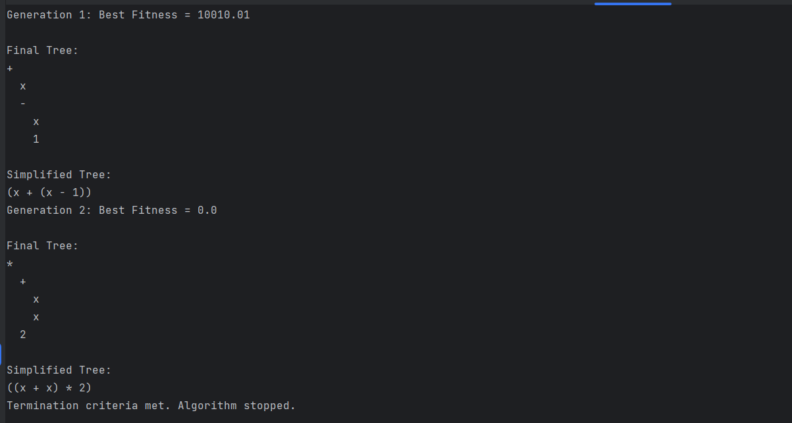

# Genetic Algorithm for Symbolic Regression

This project implements a genetic algorithm for symbolic regression. It aims to evolve mathematical expressions that approximate a target function through the use of genetic operations such as crossover and mutation.

## Project Overview

The genetic algorithm for symbolic regression is a powerful technique used to evolve mathematical expressions that approximate a target function. By employing genetic operations such as crossover and mutation, the algorithm generates a population of mathematical expressions represented as expression trees. These trees are then evolved over multiple generations to improve their fitness in approximating the target function.

- The project includes several key functionalities:

- Random Expression Tree Generation: The algorithm is capable of generating random expression trees, ensuring a diverse initial population for evolution.

- Fitness Evaluation: Each expression tree's fitness is evaluated based on its ability to approximate the target function. This evaluation provides a measure of how well the expression tree performs.

- Crossover and Mutation Operations: To introduce genetic diversity and explore different areas of the solution space, the algorithm performs crossover and mutation operations on the expression trees. Crossover involves combining the genetic material of two parent trees to create new offspring, while mutation introduces random changes to the genetic material of an individual tree.

- Expression Simplification: After crossover and mutation, the resulting expressions may become complex and convoluted. To ensure clarity and simplicity, the algorithm includes functionality to simplify these expressions.

## Algorithm Analysis

The genetic algorithm for symbolic regression utilizes a genetic approach to evolve mathematical expressions. The key component is the expression tree, where nodes represent operators or operands. The algorithm takes an initial population of these expression trees and evolves them over multiple generations.

The fitness of each expression tree is evaluated by comparing its output with the desired output of the target function. This fitness evaluation is usually based on a numerical measure such as mean squared error or mean absolute error. The algorithm aims to minimize this fitness measure, indicating a better approximation of the target function.

To introduce genetic diversity and explore different areas of the solution space, the algorithm employs crossover and mutation operations. Crossover involves selecting two parent trees and combining their genetic material to create new offspring trees. This process allows for the exchange of genetic information, potentially creating better solutions.

Mutation, on the other hand, introduces random changes to the genetic material of an individual tree. This randomness helps to explore the solution space and prevents the algorithm from converging prematurely.

The algorithm iterates through multiple generations, allowing the expression trees to evolve and improve their fitness. Each generation consists of evaluating the fitness of the population, selecting individuals for reproduction based on their fitness (using techniques such as tournament selection or roulette wheel selection), performing crossover and mutation operations, and finally, replacing the old generation with the new one.
### Optimality Check

The optimality of the genetic algorithm for symbolic regression can be assessed based on the fitness convergence over generations. The algorithm aims to minimize the fitness measure, indicating a better approximation of the target function. If the fitness consistently improves over generations and reaches a satisfactory level, the algorithm can be considered successful.

However, it's important to note that finding the optimal solution is not guaranteed, as the genetic algorithm relies on randomness and exploration of the solution space. The termination criteria for the algorithm may include reaching a satisfactory fitness level or completing a specified number of generations.

In conclusion, the genetic algorithm for symbolic regression is a powerful tool for evolving mathematical expressions that approximate a target function. By utilizing genetic operations such as crossover and mutation, the algorithm explores the solution space and improves the fitness of the expression trees over multiple generations.
## Usage

### How to Run

To run the genetic algorithm, execute the following steps:

1. Open the project in your preferred Python environment.
2. Run the script containing the genetic algorithm implementation.

### Required Libraries

Ensure you have the following Python libraries installed:

- `random`
- `numpy`
- `matplotlib`
- `copy`
- `sympy`

## Crossover and Mutation

The project implements two crossover methods: `crossover` and `crossover2`. The `mutation` operation introduces random changes to the expression trees, affecting variables, numbers, and operators.

## Obtaining Weight

The fitness of each expression tree is evaluated using a fitness function. The weights are calculated based on the fitness values, and parents are selected for the next generation with a probability proportional to their fitness.

## Function Explanation

The project includes several functions for creating, evaluating, and manipulating expression trees. Each function serves a specific purpose, and their details are explained in the [function_explanations.md](function_explanations.md) file.

## Example
In this example, the algorithm was able to guess 2sin(x)  function by using the fitness criterion, which has a coefficient difference from the original function.
.png)
 #
 #
In this example, the algorithm was able to guess 4x  function by using the fitness criterion,which is exactly the same as the main function.

#
#

In this example, the algorithm was able to guess 7x^3  function by using the fitness criterion,which is exactly the same as the main function.

#
#

In this example, the algorithm was able to guess 8x^2+18x  function by using the fitness criterion,which is 2x different from the original function,but in high values, the power of x covers this problem

It is clear that the more complex the function is, the more crossover it needs to find the rule of the function, and it can be said that it may even move away from the function with more mutations, so a balance must be created.

# Challenges
During the development and experimentation with the genetic algorithm, several challenges were identified in the crossover phase, leading to issues such as memory overflow, execution time problems, and inaccuracies in expression tree evolution. Here, we discuss each problem and propose solutions to mitigate these challenges.

## 1. Inconsistent Crossover for Sine and Cosine Operators
### Problem
The crossover of sine and cosine operators with other two-way operators may result in inconsistent and unexpected behavior. This can lead to incorrect expression trees and impact the evolution of the algorithm.
### Solution
Implement a specialized crossover mechanism for one-way operators (sine and cosine) to ensure compatibility during the crossover. This can involve creating custom crossover functions for these specific cases or adjusting the existing crossover functions to handle one-way operators differently.
## 2. Stack Overflow Issues for Multiplication, Division, and Power Operators

### Problem
Crossover involving multiplication, division, and power operators may lead to stack overflow issues, especially for deep expression trees. The recursion involved in crossover can strain system memory, causing runtime errors.

### Solution
Implement mechanisms to limit the depth of the generated trees during crossover. This can include setting a maximum depth for the generated trees or adjusting the crossover functions to avoid excessively deep expressions. Additionally, consider optimizing the crossover functions to reduce unnecessary recursion.

## 3. Performance Issues with Large Initial Population or Generations

### Problem
Executing the genetic algorithm with a large initial population or a high number of generations can lead to significant performance issues, including increased memory usage and longer execution times.

### Solution
Optimize the genetic algorithm parameters, such as the initial population size and the number of generations, based on the computational resources available. Conduct experiments to find a balance between achieving accurate results and maintaining acceptable performance. Additionally, consider parallelizing certain aspects of the algorithm to improve overall execution time.

## 4. Handling Input Interval Values

### Problem
The choice of input interval values may impact the efficiency and accuracy of the genetic algorithm. Inappropriate intervals can lead to suboptimal solutions or convergence issues.

### Solution
Carefully select input interval values based on the characteristics of the target function and the expected solution space. Experiment with different intervals to find the most suitable range for the problem at hand. Additionally, consider implementing mechanisms to dynamically adjust input intervals based on the evolving population and fitness landscape.

These proposed solutions aim to address specific challenges encountered during the crossover phase of the genetic algorithm. Customizing the crossover mechanisms and optimizing algorithm parameters are essential steps toward achieving more accurate and efficient results.

# Handling Challenges with Input Discontinuity and Multiple Dimensions

## 1. Input Discontinuity

### Problem
The presence of input discontinuity can pose challenges for the genetic algorithm, especially when the algorithm assumes a linear relationship. In cases where the function being modeled has complex rules or non-linear behavior, the algorithm may struggle to accurately predict output values.

### Solution
1. **Adaptive Representation:** Implement an adaptive representation for the genetic algorithm that allows the creation of expression trees with the flexibility to capture non-linear relationships. This can involve introducing additional operators or adjusting the algorithm to better handle discontinuities.
  
2. **Fine-Tuning Fitness Function:** Modify the fitness function to penalize solutions that fail to capture input discontinuities. By incorporating penalties for abrupt changes or non-linearity, the algorithm can be guided toward solutions that better match the true behavior of the function.

## 2. Challenges with Multiple Dimensions

### Problem
When dealing with inputs of more than one dimension, the genetic algorithm, which outputs a one-dimensional result, tends to generalize multiple dimensions into one. This can lead to oversimplified models and loss of valuable information.

### Solution
1. **Dimensionality Reduction Techniques:** Consider employing dimensionality reduction techniques, such as principal component analysis (PCA) or feature selection, to preprocess the input data. This can help preserve essential information and reduce the impact of input dimensionality on the algorithm's performance.

2. **Multi-Objective Optimization:** Instead of aiming solely for the lowest fitness value, consider incorporating multiple objectives in the optimization process. For instance, optimizing for accuracy and diversity simultaneously can encourage the algorithm to explore solutions that capture the complexity of multi-dimensional input spaces.

3. **Hybrid Approaches:** Integrate the genetic algorithm with other machine learning techniques that are better suited for handling multi-dimensional inputs, such as neural networks or ensemble methods. This hybrid approach can leverage the strengths of different algorithms to address specific challenges.

These solutions aim to enhance the genetic algorithm's ability to handle input discontinuity and improve its performance in multi-dimensional input spaces. Customizing the algorithm's representation and introducing adaptive techniques can significantly impact its effectiveness in capturing complex relationships within the data.
